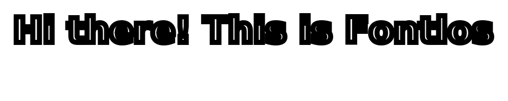

<a href="https://fontlos.com">
    </img>
</a>

<!-- <a href="https://github.com/fontlos/buaa-api">
    </img>
</a> -->

    </img>
    </img>

<picture>
    <source media="(prefers-color-scheme: dark)" srcset="https://raw.githubusercontent.com/fontlos/fontlos/output/github-contribution-grid-snake-dark.svg">
    <source media="(prefers-color-scheme: light)" srcset="https://raw.githubusercontent.com/fontlos/fontlos/output/github-contribution-grid-snake.svg">
    
</picture>

